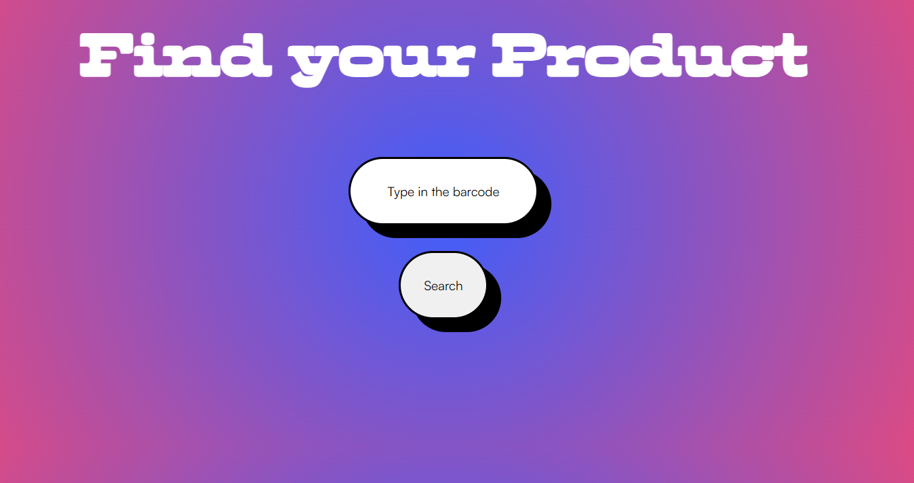
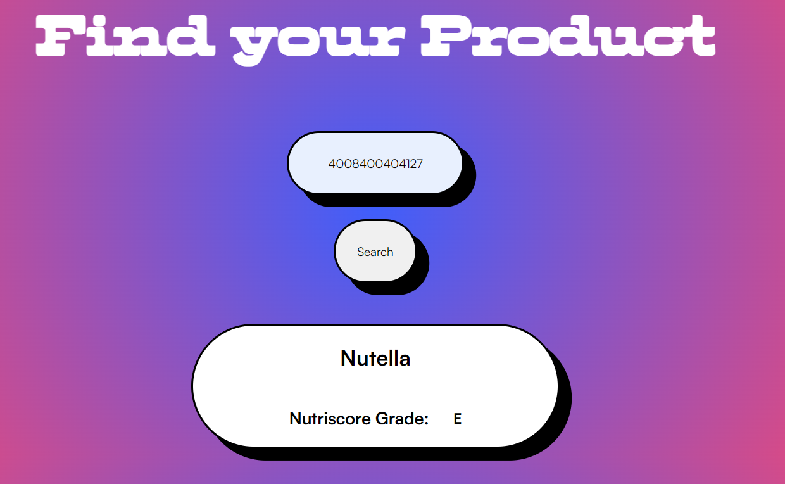

# Food Facts

Dieses Projekt ist Teil des Hackathons von [Kevin Chromik](https://www.youtube.com/@KevinChromik).

In dieser Aufgabe geht es darum die API von [Open Food](https://de.openfoodfacts.org/) in das Projekt einzubinden.

Ich habe mich dazu entschieden eine Website zu erstellen. Mir war es wichtig, dass die Seite minimalistisch und ästhetisch ist. Nicht zu viele Informationen, sondern nur den Namen und den Nutriscore des Produktes.

## Bilder

## Funktionen
Für das Einbinden der API benutze ich JavaScript.
Die response der API wird durch das DOM gerendet. Es ist wichtig, dass die Elemente und das Styling dynamisch erst gerendet werden, wenn es eine response gibt. Dadurch sind die Elemente davor erst 'hidden' und danach 'visible'

## Tools
- plain HTML, CSS, JavaScript
- Fonts von [Fontshare](https://www.fontshare.com/)
- Struktur mit [Inkdrop](https://www.inkdrop.app/)
- Organisation mit Hilfe von [ToDoist](https://todoist.com/de)
